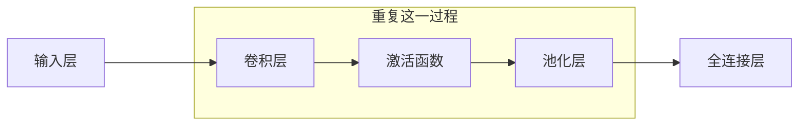

卷积神经网络, Convolutional Neural Networks, CNN, 是一种特殊类型的多层神经网络, 利用反向传播算法进行训练. 设计目标是直接从图像的像素中识别视觉部分, 而不需要做预处理, 如OCR. CNN对图像的扭曲和几何变化如平移有很强的鲁棒性, 在图像和声音设别中表现出色, 尤其是在手写数字识别, 面部检测和图像分类等任务上可以取得优异成绩.

## 历史

1989年, Yan LeCun等人首次提出了卷积神经网络的概念, 这是CNN的最早发展阶段, 主要用于手写字符识别, OCR. 2012年, AlexNet(由Alex Krizhevsky等人提出的深度卷积神经网络)在ImageNet竞赛中获取了胜利, 标志着深度学习和CNN的重大突破. AlexNet的成功显著降低了错误率, 从$26\%$降至$15\%$, 使CNN称为计算机视觉领域的主流方法.

## 优势

CNN主要用于图像的识别(也可以用于其他形式的数据). 图像由矩阵描述, 对于8位灰白图, 每个像素的取值范围是$0$到$255$, 每张图对应于一个矩阵; 对于8位彩色图, 有三种通道, 红色, 绿色和蓝色, 每个通道的的取值范围是$0$到$255$, 每个通道对应于一个矩阵, 所以每张图对应于三个矩阵.

<figure markdown='1'>
{ loading=lazy width='500' }
</figure>

传统的神经网络, 如多层前馈神经网络无法考虑图像的空间结构, 如下图显示传统神经网络会将图像的像素展平为一列, 直接作为网络的输入. 这种方式忽略了像素之间的空间关系, 导致网络难以捕捉到图像中的重要特征, 例如形状, 边缘等.

<figure markdown='1'>
{ loading=lazy width='500' }
</figure>

CNN通过卷积层和池化层等新类型的层来客服这个问题. 卷积层能够处理图像的空间信息, 保持像素之间的相对位置; 池化层则帮助减少计算量, 同时保留关键信息, 进一步提高模型的泛化能力.

传统的神经网络还对图像中的物体的位置特别敏感, 如下图. 

<figure markdown='1'>
{ loading=lazy width='500' }
</figure>

图中的字母P只是向左平移了$2$个像素, 但是输入却发生了很大的改变, 这会导致已经训练得到的模型在平移之后的图像上表现很差, CNN对这种平移或转换有很强的鲁棒性.

## 架构 

- 输入层: 接受像素值作为输入
- 卷积层: CONV, 用于从输入中提取局部特征, 通过卷积核对图像进行滑动计算, 保留纹理等特征
- 激活函数: RELU, 引入非线性因素, 帮助模型学习更加复杂的特征
- 池化层: POOL, 用于降低特征图的维度, 同时保留关键信息, 提高泛化能力
- 全连接层: FC, 也被称为密集层, 每个神经元都与前一层的所有神经元相连

???+ tip "Tip"

    在CNN中, 通常不会特别详细地写出激活函数, 例如ReLU, 这是因为激活函数已经称为深度学习中一个非常标准和默认的操作, 尤其是在卷积层(CONV)之后, 一定会有一个激活函数. 在描述网络架构的时候, 通常将其省略.

如下图所示, $3$个重复的CONV-RELU-POOL和$2$个全连接层.

<figure markdown='1'>
{ loading=lazy width='500' }
</figure>

CNN在架构上的变化非常灵活, 可能产生的问题有:

- 组合CNN各个部分(CONV, RELU, POOL, FC)的正确方式
- 需要多少层卷积层
- 卷积核的大小
- 池化层的频率, 是在每个卷积层之后还是更少
- 池化层的大小, 是AP还是MP

根据这些问题, 可能产生很多不同种类的CNN架构, 常见的CNN架构有LeNet-5, AlexNet, VGG和GoogleLeNet.

### LeNet-5

LeNet-5的架构为CONV\*2, POOL\*2, FC\*3. 

<figure markdown='1'>
{ loading=lazy width='550' }
</figure>

### AlexNet

AlexNet的架构为CONV\*5, POOL\*3, FC\*3. 

<figure markdown='1'>
{ loading=lazy width='550' }
</figure>

该就是2012年Krizhevsky等人在ImageNet竞赛上所使用的架构.它们将错误率降到了$16.4\%$, 如图所示, 人类分类的错误率为$5.1\%$.

<figure markdown='1'>
{ loading=lazy width='550' }
</figure>

### VGG

VGG架构由Simonyan和Zisserman等人在2014年提出, 这是一个改进类型的更深的AlexNet. https://arxiv.org/abs/1409.1556

该架构使用的是$3\times 3$的卷积核, 步长为$1$, 填充为$1$, 使用的是MP, 池化步长为$2$. 

<figure markdown='1'>
{ loading=lazy width='300' }
</figure>

### GoogleNet

GoogleNet架构由Szegedy等人在2014年提出, 这是一个更深的, 计算上效率更高的架构. 它是ILSVRC'14分类竞赛的获胜者-$6.7\%$的错误率. https://arxiv.org/abs/1409.4842

GoogleNet总共包含了$22$层深度神经网络, 仅有$500$万个参数, 比AlexNet少$12$倍, 比VGG-16少$27$倍. 它没有全连接层, 改用绿全局平均池化, global average pooling. 采用了更加高效的"Inception"模块.

## 层

### 卷积层 {#convolutional-layer}

<figure markdown='1'>
{ loading=lazy width='250' }
</figure>

卷积类似于在矩阵上应用一个滑动窗口, 对应的元素(滤波器/卷积核的权重和图像的像素值)进行相乘并求和. 以一个黑白图片作为例子, 其中像素值为$1$或者$0$. 这里使用了一个$3\times 3$的卷积核, 它从左到右, 从上到下在图像上滑动, 在每一步都执行卷积操作. 卷积的结果称为"特征图"或者"激活图". 在上图中, 特征图的第一个值为$4$, 计算过程为$1\times 1 + 1\times 0 + 1\times 1 + 0\times 0 + 1\times 1 + 1\times 0 + 0\times 1 + 0\times 0 + 1\times 1 = 4$.

<figure markdown='1'>
{ loading=lazy width='300' }
</figure>

我们可以将卷积核看作是一个特征发现器. 如下图是一个发现一条曲线的卷积核.

<figure markdown='1'>
{ loading=lazy width='400' }
</figure>

现在, 我们将这个卷积核用于一张我们想要分类图片(一张老鼠🐭的简笔画)的左上角上, 

<figure markdown='1'>
{ loading=lazy width='500' }
</figure>

在这个区域进行卷积计算得到的值为$(50\times 30)+(50\times 30)+(50\times 30)+(20\times 30)+(50\times 30)=6600$, 这个值非常大! 说明这边很可能有一根类似的曲线.

我们尝试将卷积核移到图片的另一个地方, 老鼠的耳朵上.

<figure markdown='1'>
{ loading=lazy width='550' }
</figure>

在这个区域进行卷积计算计算得到的值为$0$. 这说明在图上没有任何和曲线卷积核相同的地方.

所以说, 特征图会显示在图像中有曲线的部分, 较大的值就意味着有一根曲线"激活"了卷积核; 较小的值就意味着图像中没有曲线. 每个卷积层都可能有多个卷积核, 每个卷积核都会产生一个特征图, 如果某个卷积层有$n$个卷积核, 卷积操作后, 这个卷积层将输出$n$个不同的特征图, 每个特征图代表卷积核检测到的特定模式或特征, 比如, 某些卷积核可能检测出边缘, 某些卷积核可能检测到圆形或者线条.

需要注意的是, 和上面例子不同的是, 在现实中, 卷积核是神经网络自动学习的, 它们的值不是预先设计好用于检验某种特定的特征, 而是通过训练数据自动进行学习的, 这里的关键就是反向传播算法的作用, 它使得卷积核可以通过训练不断更新, 从而适应不同的任务需求.

#### 数量

每个卷积核都会处理输入数据中的所有通道, 比如RGB图片中, 卷积核如$28\times 28\times 3$可以有$64$个, 这$64$个卷积核每个都会生成一个独立的特征图. 

#### 深度

卷积核的深度就是输入的通道数, 比如RGB图片的通道数为$3$, 卷积核如$28\times 28\times 3$的深度就是通道数$3$. 如果是灰度图, 那么卷积核的深度就是$1$. 在RGB图片中, 卷积核其实可以理解为分成三个不同的子卷积核, 然后这三个子卷积核分别提取不同通道的同一特征, 最后生成一个特征图.

#### 步幅 {#stride}

在之前我们的例子中, 卷积核每次只右移动一个单位. 当它到达最右边的时候, 会下移动一格然后移动到最左边. 我们称这种情况下水平步幅和垂直步幅都是$1$, 即$s_h=1, s_v=1$. 

<figure markdown='1'>
{ loading=lazy width='500' }
</figure>

越大的步幅会产生越小的特征图.

<figure markdown='1'>
{ loading=lazy width='300' }
</figure>

#### 填充

当我们将卷积核移动到行尾或者列尾的时候, 可能会"超出"原图的边界. 超出边界的那一部分我们可以用$0$来填充超出的部分. 填充的大小是一个超参数. 填充可以处理图像的边缘区域, 防止边缘区域信息丢失. 

<figure markdown='1'>
{ loading=lazy width='500' }
</figure>

#### 感受野[^1]

感受野, receptive field. 特征图上某个元素的计算受输入图像上的某个区域影响, 这个区域就是该元素的感受野. 在卷积神经网络中, 越深层的神经元看到的输入区域越大, 如下图所示, 卷积核的大小均为$3\times 3$, 步幅均为$1$. 第二层的每个神经元可以看到第一层的$3\times 3$大小的区域, 第三层的每个神经元可以看到第二层上$3\times 3$大小的区域, 又可以看到第一层上$5\times 5$大小的区域.

<figure markdown='1'>
{ loading=lazy width='250' }
</figure>

所以, 感受野是一个相对的概念, 某层的特征图上的元素看到前面不同层的区域范围是不同的, 通常在不特殊指定的情况下, 感受野指的是看到输入图像上的区域.

### 激活函数

在特征图上, 我们会使用激活函数, 通常是ReLU. ReLU比sigmoid或者tanh更简单, 意味着运算速度更快. 没有上限, 更少的[梯度消失](/algorithm/neural-network/fnn/#vanishing-gradient). 

<figure markdown='1'>
{ loading=lazy width='300' }
</figure>

### 池化层 {#subsampling-layer}

池化, 又叫作subsampling, 作用包括[^2]:

- 通过降采样增大网络的感受野
- 通过信息提取抑制噪声, 进行特征选择, 降低信息的冗余
- 通过减小特征图的尺寸降低模型的计算量, 降低网络优化难度, 减少过拟合风险
- 使模型对输入图像中的特征位置变化(变形, 扭曲, 平移)更加鲁棒

通用的池化方法包括最大池化, 平均池化, 混合池化, 分数最大池化, 等等. 下面的图片展示了一个$2\times 2$的窗口和步长为$2$的最大池化过程.

<figure markdown='1'>
{ loading=lazy width='400' }
</figure>

原图像(左边$4\times 4$的矩阵)通过最大池化操作, 每个$2\times 2$区域中取最大值, 最终输出了一个$2\times 2$的池化结果:

- 左上角$2\times 2$区域的最大值为$6$
- 右上角$2\times 2$区域的最大值为$6$
- 左下角$2\times 2$区域的最大值为$3$
- 右下角$2\times 2$区域的最大值为$4$

而另一种池化的方法, 平均池化, 如下图所示.

<figure markdown='1'>
{ loading=lazy width='400' }
</figure>

哪种池化的方法好取决于给到的任务. MP会选择特征图中像素值最大的, 所以特别适合较黑的图像中较量的特征识别. 而AP会使得特征图更加平滑, 减少细节和噪声.

<figure markdown='1'>
{ loading=lazy width='550' }
</figure>

### 全连接层

在CNN的末尾, 我们通常会附上一个或者多个全连接层.

第一个全连接层接受上一个CONV或者POOL的输出. 然后第一件要做的事就是展平, flatten, 即将多维的矩阵转化为一个可以被FC接受的向量.

<figure markdown='1'>
{ loading=lazy width='200' }
</figure>

FC的最后一层会输出一个$n$维的向量, $n$是类的数量, 我们通常使用softmax函数输出每个类的概率. 

## 多通道 {#multi-channel}

前面我们讲过, 彩色图有$3$个通道.

<figure markdown='1'>
{ loading=lazy width='550' }
</figure>

如下图所示, 这是一个经过修改的用于多通道的CNN.

<figure markdown='1'>
{ loading=lazy width='550' }
</figure>

如下图, 输入图像的尺寸为$32\times 32\times 3$, 这意味着输入图像是一个$32\times 32$像素的彩色图像, $3$代表图像的通道数, 即RGB的三个颜色通道. 卷积核的尺寸为$5\times 5\times 3$, 这表示卷积核的空间尺寸为$5\times 5$, 同时它在第三个维度上与输入图像的通道数相同, 这确保卷积核能够对图像的所有通道进行匹配, 这里的卷积核可以理解为由$3$个单独的$5\times 5$卷积核组成, 每个卷积核对因个输入图像的一个通道, 它们会分别在各自的通道上进行卷积操作. 然后, 将这三个通道的卷积结果相加, 得到综合后的一个$28\times 28\times 1$的特征图.

<figure markdown='1'>
{ loading=lazy width='500' }
</figure>

[^1]: 彻底搞懂感受野的含义与计算 - shine-lee - 博客园. (不详). 取读于 2024年9月18日, 从 https://www.cnblogs.com/shine-lee/p/12069176.html
[^2]: 郑之杰. (2002, 七月 21). 卷积神经网络中的池化(Pooling)层. 郑之杰的个人网站. https://0809zheng.github.io/2021/07/02/pool.html

## 升降维

使用$1\times 1$的卷积核可以对输入进行升降维.

从[多通道](#multi-channel), 可以了解, 当输入有多个通道的时候, 如RGB图片的$3$个通道, 每个卷积核的深度就是通道数. 这点对特征图来说也是一样的, 例如, 对于一张RGB图片, 我们在第一个卷积层用了$128$个$3\times 3\times 3$的卷积核, 那么会生成$128$张特征图, 第二层我们使用了$64$个$1\times 1\times 128$的卷积核, 即卷积核的深度$128$和特征图的通道(即它的数量$128$)相同. 每个卷积核都会处理$128$个通道的信息, 生成一个新的特征图, 而我们有$64$个卷积核, 所以会生成$64$个特征图. 并且, 这些特征图的长度和宽度和第一层卷积之后特征图的长度和宽度是相等的. 

这种操作能够在不改变长度和宽度的情况下, **调整特征图的通道数**, 从而控制参数量和计算复杂度.