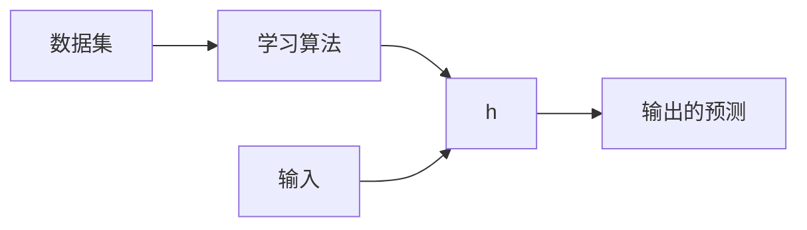

???+ info "信息"

    - 前置知识
		- [概率论](/数学/概率论)
    - 默认省略例子边框
	- Jupyter Notebook练习: 
		- 魔改版: 点击[这里](https://drive.google.com/file/d/1jBR4gyvUiFLpiWij5gYdzDhV4LNJv01q/view?usp=sharing)
		- 原始版: 点击[这里](https://share.ricolxwz.io/machine-learning/notebook/andrew-ng/ex1_linear_regression.ipynb)
	- 推荐阅读
		- [梯度下降和随机梯度下降](http://zh.gluon.ai/chapter_optimization/gd-sgd.html)

???+ bug "Bug"

	向量和标量之间表示不清楚, 向量应该由粗体注明.

线性回归属于监督学习, 同时是一个回归问题.

## 单变量线性回归

单变量线性回归(1), 指的是只有一个特征的回归模型. 
{.annotate}

1. univariate linear regression

### 模型表示

#### 问题

例子: 预测住房价格.

数据集: 已知一个数据集, 包括某个城市的住房价格. 每个样本包括住房尺寸和售价.

要求: 根据不同住房尺寸所出售的价格, 画出数据集.

问题: 对于一个给定的住房尺寸, 预测它的售价.

这个数据集可以用坐标表示:

{:style="width:400px"}

也可以用表格表示:

| 房屋大小 ($x$) | 价格 ($y$) |
| :---:         |     :---:      |
| 2104 | 460 |
| 1416 | 232 |
| 1534 | 315 |
| 852  | 178 |
| ...  | ... |
| 3210 | 870 |

#### 术语

用如下符号来描述这个问题:

- $m$: 代表数据集中样本数量
- $x$: 代表输入
- $y$: 代表输出, 数据集中的实际真实值
- $\hat{y}$: $y$的估计或预测
- ($x, y$): 代表数据集中的一个样本
- ($x^{(i)}, y^{(i)}$): 代表第$i$个样本
- $h$: 代表学习算法的模型或函数也称为假设(hypothesis)

#### 流程

1. 把数据集输入到学习算法
2. 学习算法计算出函数$h$. 函数的输入是输入$x$, 输出是输出的预测$\hat{y}$

#### 模型

对于房价预测问题, 模型/函数$h$可能的表述如下:

$h_{\theta}(x)=\theta_0+\theta_1 x$

将$\theta_0$和$\theta_1$称为模型/函数的参数. 在机器学习中, 模型的参数是可以在训练期间调整以改进模型的变量. 对于线性回归, 要做的就是选择参数的值以便更好的拟合数据, 选择的参数决定了$h$相对与数据集的准确程度.

定义建模误差(1)为模型所预测的值$\hat{y}$和实际值$y$之间的差距(蓝线表示):
{.annotate}

1. modeling error

{:style="width:400px"}

### 代价函数 {#代价函数}

- 基于均方误差函数最小化来进行模型求解的方法成为"最小二乘法"/"最小二乘估计".

#### 最小二乘估计

为了求解模型并衡量模型$h$的性能, 常见的方法是定义代价函数(1). 最常用的是均方误差函数(2):
{.annotate}

1. cost function
2. mean squared error

$J(\theta_0, \theta_1)=\frac{1}{2m}\sum^m_{i=1}(h_{\theta}(x^{(i)})-y^{(i)})^2=\frac{1}{2m}\sum^m_{i=1}(\hat{y}^{(i)}-y^{(i)})^2$

选取参数$\theta_1$和$\theta_2$以最小化代价函数$J$, 从而优化模型$h$.

???+ tip "Tip"

    除以$2$是为了让后面的计算看起来更加整洁, 无论是否除以$2$, 代价函数都有效.
    
可以绘制这个函数, 三个坐标分别为$\theta_0$, $\theta_1$, $J(\theta_0, \theta_1)$, 可以看到在三维空间中存在一个使得代价函数$J(\theta_0, \theta_1)$最小的点:

{:style="width:400px"}

将其呈现为等高线图:

{:style="width:550px"}

根据上图, 人工的方法很容易找到代价函数最小时对应的$\theta_0, \theta_1$, 但是我们真正需要的是一种有效的算法, 能够自动找出这些使代价函数达到最小值的参数, 参见下面的解法.

### 求解代价函数

#### 梯度下降 {#梯度下降}

梯度下降是一种求函数最小值的算法. 

梯度下降的思想是开始时随机选择一个参数组合$\theta_0, \theta_1$, 计算代价函数. 然后寻找下一个能让代价函数值下降最多的参数组合. 持续这么做会找到一个局部最小值, 因为我们没有尝试完所有的参数组合, 所以无法确定得到的局部最小值是否是全局最小值, 选择不同的初始参数组合, 可能会得到不同的局部最小值.

以输入为两个参数的代价函数为例, 不同的起始点导致不同的局部最小值:

{:style="width:400px"}

???+ tip "Tip"

	为了理解梯度下降, 可以想象站在山的一点上, 并且希望用最短的时间下山. 在梯度下降算法中, 要做的就是旋转360度, 看看周围, 要在某个方向上用小碎步尽快下山, 这些小碎步需要朝向什么方向? 如果我们站在山坡上的这一点, 看一下周围, 你会发现最佳的下山方向, 按照自己的判断迈出一步. 重复上述的步骤, 从新的位置, 环顾四周, 并决定从什么方向将会最快下山, 然后又迈进了一小步, 并依次类推, 直到你接近局部最低点的位置.
	
单变量线性回归的批量梯度下降(1)算法可以抽象为公式:
{.annotate}

1. batch gradient descent

$\mathrm{Repeat} \ \{\theta_j:=\theta_j-\alpha\frac{\partial}{\partial \theta_j}J(\theta_0, \theta_1)\}$, $j=0, 1$

???+ note "笔记"

	"批量"指的是在梯度下降的每一步中, 都用到了所有的训练样本. 详情见[这里](#在线性回归中的应用).

其中$\alpha$是学习率(1), 它决定了沿着能让代价函数下降程度最大的方向向下迈出的步子有多大; 在批量梯度下降中, 每一次同时让所有的参数减去学习速率乘以代价函数的偏导数. 

???+ warning "注意"

	更新的时候需要同时更新所有的参数, 而不是逐个更新. 这种更新的方式确保了在计算下一个参数的梯度的时候, 其他参数的值保持不变. 在同步更新中, 所有的偏导数都是基于同一组参数值$\theta_0, \theta_1$计算的.
	
	{:style="width:400px"}
  
##### 直观理解

考虑梯度下降的公示. 其中求导, 就是取下图红点的切线. 红色直线的斜率正好是三角形的高度除以水平长度, 这条线的斜率为正数, 也就是说它有正导数. 因此, $\theta_1$更新后等于$\theta_1$减去一个正数乘以$\alpha$.

{:style="width:550px"}

$\alpha$的取值的影响:

- 如果$\alpha$太小, 红点一点一点挪动, 需要很多步才能到达最低点
- 如果$\alpha$太大, 红点可能会直接越过最低点, 斜率的绝对值也有可能变大, 可能导致无法收敛
  
{:style="width:550px"}

如果我们预先把$\theta_1$放在局部的最低点, 下一步是什么?

假设将$\theta_1$初始化在局部最低点, 局部最低点的偏导数等于$0$. 因此$\theta_1$不再改变. 所以如果参数已经处于局部最低点, 那么对于那个参数来说, 梯度下降法什么都没做. 

在来看一遍这个过程:

{:style="width:550px"}

从品红点开始, 前进一步到绿点, 偏导数会减小, 在到新的红点, 偏导数继续减小, 所以每一步$\theta_1$更新的幅度都是在自动减小的. 直到最终的幅度趋近于$0$, 这个时候已经收敛到局部最小值.

???+ abstract "总结"

	- 在梯度下降法中, 当接近局部最低点的时候, 会自动采取更小的幅度. 这是因为偏导数会变得越来越小
	- 可以用梯度下降法最小化任何代价函数, 而不知是线性回归的代价函数
	
##### 在单变量线性回归中的应用 {#在线性回归中的应用}

在单变量线性回归中, 我们选择的[代价函数](#代价函数)是均方误差函数:

$J(\theta_0, \theta_1)=\frac{1}{2m}\sum^m_{i=1}(h_{\theta}(x^{(i)})-y^{(i)})^2$

- 对于$\theta_0$的偏导数为:

	$\frac{\partial}{\partial \theta_0}J(\theta_0, \theta_1)=\frac{\partial}{\partial \theta_0}\frac{1}{2m}\sum^m_{i=1}(h_{\theta}(x^{(i)})-y^{(i)})^2=\frac{\partial}{\partial \theta_0}\frac{1}{2m}\sum^m_{i=1}(\theta_0+\theta_1 x^{(i)}-y^{(i)})^2=\frac{1}{m}\sum^m_{i=1}(\theta_0+\theta_1 x^{(i)}-y^{(i)})=\frac{1}{m}\sum^m_{i=1}(h_{\theta}(x^{(i)})-y^{(i)})$
	
- 对于$\theta_1$的偏导数为:

	$\frac{\partial}{\partial \theta_1}J(\theta_0, \theta_1)=\frac{\partial}{\partial \theta_1}\frac{1}{2m}\sum^m_{i=1}(h_{\theta}(x^{(i)})-y^{(i)})^2=\frac{\partial}{\partial \theta_1}\frac{1}{2m}\sum^m_{i=1}(\theta_0+\theta_1 x^{(i)}-y^{(i)})^2=\frac{1}{m}\sum^m_{i=1}(\theta_0+\theta_1 x^{(i)}-y^{(i)})x^{(i)}=\frac{1}{m}\sum^m_{i=1}(h_{\theta}(x^{(i)})-y^{(i)})x^{(i)}$
	
根据批量梯度下降算法, 可以写出如下公式:

$\mathrm{Repeat}\ \{\theta_0:=\theta_0-\alpha \frac{1}{m}\sum_{i=1}^m(h_{\theta}(x^{(i)})-y^{(i)})\quad \theta_1:=\theta_1-\alpha \frac{1}{m}\sum^m_{i=1}(h_{\theta}(x^{(i)})-y^{(i)})x^{(i)}\}$

所谓"批量"由来是: 在梯度下降, 计算偏导数时, 需要求和运算, 对于每一个单独的梯度下降中, 最终都要计算这样一个东西, 我们用到了所有的训练样本.

## 多变量线性回归

### 模型表示

#### 问题

在之前的房价预测问题里面, 只考虑了一个特征, 即房屋大小, 这里我们考虑多个特征的问题, 比如在房价预测问题中, 引入房间数, 楼层, 年限等.

下面是一个示例数据:

| 房屋大小 | 房间数 | 楼层 | 年限 | 价格 ($y$) |
|:--------:|:------:|:----:|:----:|:----------:|
|   2104   |    5   |   1  |  45  |     460    |
|   1416   |    3   |   2  |  40  |     232    |
|   1534   |    3   |   2  |  30  |     315    |
|    852   |    2   |   1  |  36  |     178    |
|    ...   |   ...  |  ... |  ... |     ...    |

#### 术语

由于多维的特性, 需要引入更多的术语:

- $n$: 特征的数量
- $x^{(i)}$: 第$i$个样本/输入
- $x_j^{(i)}$: 第$i$个样本/输入中的第$j$个特征

#### 模型

对于房价预测问题, 模型/函数$h$可能的表述如下:

$h_{\theta}(x)=\theta_0+\theta_1 x_1+\theta_2 x_2+...+\theta_n x_n$

上述的公式中有$n+1$个参数和$n$个变量, 为了简化公式, 引入$x_0=1$, 上式写作:

$h_{\theta}(x)=\theta_0+\theta_1 x_1+\theta_2 x_2+...+\theta_n x_n=\theta^TX$, $T$表示矩阵转置.

### 代价函数

在多变量线性回归中, 也可以构建一个代价函数, 选取均方误差函数表示为:

$J(\theta_0, \theta_1, ..., \theta_n)=\frac{1}{2m}\sum^m_{i=1}(h_{\theta}(x^{(i)})-y^{(i)})$

### 求解代价函数

#### 梯度下降 

多变量梯度下降的目标和单变量线性回归中的一样, 要找出使代价函数最小的一些列参数. 多变量线性回归的批量梯度下降算法可以抽象为公式:

$\mathrm{Repeat}\ \{\theta_j:=\theta_j-\alpha\frac{\partial}{\partial \theta_j}J(\theta_0, \theta_1, ..., \theta_n)\}$, $j=0, 1, ..., n$

##### 在多变量线性回归中的应用

在多变量线性回归中, 我们选择的[代价函数](#代价函数)为均方误差函数:

$J(\theta_0, \theta_1, ..., \theta_n)=\frac{1}{2m}\sum^m_{i=1}(h_{\theta}(x^{(i)})-y^{(i)})$

对于$\theta_j$的偏导数为:

$\frac{1}{m}\sum^m_{i=1}(h_{\theta}(x^{(i)})-y^{(i)})x_j^{(i)}$

根据批量梯度下降算法, 可以写出如下公式:

$\mathrm{Repeat}\ \{\theta_j:=\theta_j-\alpha\frac{1}{m}\sum^m_{i=1}(h_{\theta}(x^{(i)})-y^{(i)})x_j^{(i)}, j=0, 1, ..., n\}$

##### 特征缩放

在面对多变量线性回归时, 要保证特征具有相近的尺度, 使梯度下降算法更快收敛.

以房价问题为例, 假如有两个特征, 房屋尺寸和房间数量. 尺寸值为$0-2000$平方英尺, 房间数量为$0-5$. 以这两个参数为横纵坐标, 绘制代价函数的等高线图, 可以看出图像会很扁. 梯度下降算法需要非常多次的迭代才能收敛.

{:style="width:200px"}

???+ bug "Bug"

	上图中$J(\theta)$函数是一个关于$\theta_0$的函数, 在上图中没有很好的体现出来.

解决方法是尝试将所有特征的尺度都尽量缩放到$-1$和$1$之间.

{:style="width:550px"}

###### 数据标准化

对于特征缩放, 一个更正规的方法是做数据标准化, 将所有的数据都限制到一个合理的区间内.

标准化公式为:

$x_n=\frac{x_n-\mu_n}{s_n}$

其中$\mu_n$是平均值, $s_n$是标准差.

##### 学习率

梯度下降算法收敛所需要的迭代次数根据模型的不同而不同, 虽然不能提前预知, 但是可以画出迭代次数和代价函数的图标连观测算法在何时趋于收敛. 如下图所示, 可以看到代价函数随着迭代次数增加而不断减小. 当迭代次数来到300次后, 代价函数降低的趋势已经非常小了, 说明已经收敛.

{:style="width:400px"}

也有一些自动测试是否收敛的方法, 例如将代价函数的变化值和某个阈值(例如0.0001)进行比较, 如果比阈值小, 就认为已经收敛. 

原则是: 有效的学习率可以让代价函数随着迭代不断减小. 但是太小的学习率会导致收敛得很慢.

### 特征工程

特征工程是机器学习流程最花时间的步骤, 也是最重要的工作内容之一. 特征工程是一个过程, 这个过程将数据转换为能更好的表示业务逻辑的特征, 从而提高机器学习的性能. [^4]

机器学习模型的准确度取决于特征的精确几何和组成. 例如, 在推荐音乐播放列表的机器学习应用程序中, 特征可能包含歌曲评分, 播放历史以及播放时长. 创建特征可能需要大量的工程工作. 特征工程涉及从原始数据(如价目表, 产品说明和销售量)中提取和转换变量, 以便您可以使用特征进行训练和预测. 工程特征所需要的步骤包括数据提取和清理, 以及特征创建和存储. [^5]

以房价预测为例. 

首先选择多变量线性回归, 选择长度和宽度作为特征输入: $h_{\theta}(x)=\theta_0+\theta_1\times$长度$+\theta_2\times$宽度.

注意: 

- 基于大量数据的简单模型优于基于少量数据的复杂模型
- 更多的数据优于聪明的算法, 而好的数据优于多的数据

上述的房价预测模型应该改为更加高效的单变量线性回归, 用面积来代替宽度和长度, 作为特征输入: $h_{\theta}(x)=\theta_0+\theta_1\times$面积.

### 多项式回归

线性回归并不适用于所有数据, 有时需要曲线来适应我们的数据, 比如一个二次方模型: $h_{\theta}(x)=\theta_0+\theta_1x+\theta_2x^2$或者三次方模型$h_{\theta}(x)=\theta_0+\theta_1x+\theta_2 x^2+\theta_3 x^3$. 通常, 我们需要先观察数据然后再决定模型的类型.

## 欠拟合和过拟合

{:sytle="width:600px"}

在[多项式回归](#多项式回归)模型中, 存在欠拟合(Underfitting)和过拟合(Overfitting).

- 欠拟合: 发生在我们使用过于简单的模型时. 例如, 用一条水平直线来拟合所有的数据点. 这条线可能会忽略数据中明显的趋势, 导致在训练数据和新数据上表现都不佳
- 过拟合: 开起来可能不像是一条直线, 而更像是非常复杂的曲线. 这条曲线会试图通过每一个训练数据点, 看起来在训练集熵的表现极佳, 但是它可能对数据中的噪音极度敏感, 导致在新数据熵的表现糟糕

{:style="width:500px"}

在上图中, 水平轴表示模型的复杂度. 简单的模型位于左侧(欠拟合), 复杂的模型位于右侧(过拟合). 垂直轴表示误差, 数值越低表示模型的表现越好. 经验风险(empirical risk)是在训练数据上测量的误差. 随着模型复杂度的增加, 经验风险会一直下降. 真实风险(true risk)是模型在从未见过的数据(如测试集)上的实际表现. 在模型复杂度较低时, 真实风险会较高, 因为模型欠拟合. 随着复杂度的增加, 真实风险逐渐降低. 然而, 当模型变得过于复杂度的时候, 真实风险又开始上升, 因为此时模型过拟合, 变得过于依赖训练数据, 导致泛化能力的下降.

### 偏差和方差 

首先, 我们用一个例子来解释偏差和方差之间的关系.

假设我们在射击馆, 我们的一次射击就是对一个样本进行预测, 用红色靶心表示真实值, 蓝色的命中点作为预测值. 偏差表示的就是蓝色的命中点和红色的命中点之间距离的远近, 若距离大, 则偏差大; 若距离小, 则偏差小. 方差表示的是蓝色的命中点的位置是否聚集, 蓝色的命中点之间越集中, 则表示方差越小, 反之方差越大.

以过拟合作为示例, 过拟合的情况下, 模型在训练集上的偏差很小, 但是在测试集上的偏差很大, 也就是说, 它的方差很大, 对训练集中的数据做一点轻微的扰动都会导致偏差上升. 对于欠拟合来说, 模型在训练集和测试集的偏差都很大, 但是两个偏差的差异不大, 及方差较小. 

{:style="width:500px"}

从图中可以看出, 在过拟合的情况下, 训练集的偏差很小, 方差很大. 在欠拟合的情况下, 训练集的偏差很大, 方差很小.

## 正则化 [^6]

正则化主要用于控制模型的复杂度和防止过拟合. 其核心目的是改善模型的泛化能力, 即模型在新未见数据上的表现. 正则化可以通过在模型的代价函数中添加一个额外的项来实现. 

- 防止过拟合: 过拟合发生在模型对训练数据学得"太好", 以至于它甚至学到了数据中的噪声和误差, 导致模型在新数据上的表现不佳. 正则化通过惩罚的复杂度(如, 通过惩罚过大的参数值)来避免这种情况. 如上图, 若$\theta_3, \theta_4$趋近于0, 那么曲线会更加平滑, 对新数据上表现更加好
- 选择特征: 某些类型的正则化(如L1正则化)可以帮助进行特征选择, 因为它们倾向于将某些参数的估计值压缩到0. 这种性质使得L1正则化特别适用于处理那些具有大量特征, 但只有少数几个特征真正重要的情形

正则化主要分为L1正则化, L2正则化和弹性网(L1和L2的集合).

### L1正则化

L1正则化, 也称为Lasso回归. 添加了L1正则化的损失函数一般可以表示为$||X\omega-y||^2_2+\alpha||\omega||_1$. L1正则化容易产生稀疏系数矩阵, 即较多参数为0, 因此也可以用于特征选择.

### L2正则化

L2正则化, 也称为Ridge回归, 岭回归. 添加了L2正则化的损失函数一般可以表示为$||X\omega-y||_2^2+\alpha||\omega||_2^2$. L2正则化倾向于让参数值减小, 但是不会完全为0.

## 随机梯度下降

随机梯度下降, Stochastic Gradient Descent, SGD. 它的代价函数可以被表示为$f_j(\omega)\simeq (\omega x^{(j)}-y^{(j)})^2$, 其中$x^{(j)}$和$y^{(j)}$是每次下降中随机选取的特征和标签, 在SGD中, 代价函数是会随着下降的过程产生变化的, 即$x^{(j)}$和$y^{(j)}$在每一次下降中都不同. 我们的目标就是要最小化这个变化的代价函数. 这个函数的导数为$x^{(j)}(\omega x^{(j)}-y^{(j)})$, 同样的, 这个导数也是一直在变化的. 如果我们考虑将变量换成向量的形式(即将所有的$k$个参数表示为一个向量), 我们可以得到$w_{i+1}=w_{i}-\alpha_i(w_i^Tx^{(j)}-y^{(j)})x^{(j)}$, 即$w_{i+1}=w_{i}-\alpha_i\nabla f_j(w_i)$, $\nabla f_j(w_i)=[\frac{\partial f_j(\omega)}{\partial \omega_1}, ..., \frac{\partial f_j(\omega)}{\partial \omega_k}]$.

与正常的梯度下降比较, SGD能够耗费更少的算力. 每次下降都只用随机选择一个特征和标签, 每次下降都少算$n$次, 所以在时间复杂度上是$O(k)$. 但是也有缺点, 它可能需要更多次的下降才会收敛, 并且更不稳定, 如图:

## 小批量梯度下降

小批量梯度下降, mini-batch SGD. 它介于随机梯度下降和梯度下降之间, 即选取一部分特征和标签用于计算每次下降的导数. 它的表达式为$w_{i+1}=w_{i}-\alpha_i\sum_{j\in B_i}^n(w_i^Tx^{(j)}-y^{(j)})x^{(j)}$即$w_{i+1}=w_{i}-\alpha_i\nabla f_{B_i}(w_i), j\in B_i$. 每次选取的特征和标签应该在$B_i$这个集合里面.

这里是一张更为直观的三种梯度下降方式的对比图.

{:style="width:500px"}

它的性能应该介于SGD和GD之间, 可以通过调整$B_i$这个集合的大小对模型进行微调. 对比GD, 它收敛地更慢.

## 线性分类

线性分类其实是线性回归的一种衍生, 线性回归的预测结果放到一个符号函数$sign$里面产生的结果就是线性分类的预测结果.

如我们根据线性回归预测得到的模型为$3x_1-4x_2-1=0$, 这个又被称为"决策边界", 对于样本向量$x=[1, 2, 3]^T$来说, 预测结果为$w^Tx=1$, 这个结果放到符号函数里面, 得到线性分类的预测结果$\hat{y}=sign(1)=1$. 再来举一个例子, 对于样本向量$x=[1, 3, 2.5]^T$, 预测结果为$w^Tx=-2$, 这个结果放到符号函数里面, 得到线性分类的预测结果$\hat{y}=sign(-2)=-1$. 

{:style="width: 600px"}

### 评估预测结果

线性回归评估标签和预测结果的"近似程度", 即通过一个方差来评估. 而线性分类的值本身就是离散的, 对的就是对的, 错的就是错的.

## 逻辑回归

逻辑回归用于分类问题, 特别二分类问题. 我们想要知道在给定某些输入特征(比如身高, 体重, 年龄等)时, 某个事件发生的可能性有多大. 逻辑回归的目标就是估计这个概率, 即给定输入特征$X$, 事件$y=1$发生的概率(比如购买产品), 这就是条件概率$p(y=1|X)$.

Again, 逻辑回归是线性回归的一种衍生. 线性回归返回的是一个实数, 而逻辑回归先要转为一个$0$到$1$之间的概率, 然后用这个概率判断属于哪一各类或者也可以直接使用这个概率作为预测结果. 和线性分类类似, 我们需要有一个函数来完成概率的转换, 这里用到的就是逻辑函数$\sigma$.

逻辑函数的表达式为$\sigma(z)=\frac{1}{1+exp(-z)}$. 这个函数的图像如下:

{:style="width:400px"}

可以看到, 当输入是一个很大的正数的时候, 趋近于$1$, 输入是一个很大的负数的时候, 趋近于$0$. 一般来说, 我们将输出趋近于$1$表示为预测结果分类为$1$, 输出趋近于$0$表示为预测结果分类为$0$. 因此, 输出的概率越大, 表示的是分类为$1$的概率越大, 这是事先规定好的.

这里, 我们的输入是线性回归的预测结果$w^Tx$, 可以得到:

- $p[y=1|X]=\sigma(w^Tx)$, 表示的属于分类$y=1$的概率
- $p[y=0|X]=1-\sigma(w^Tx)$, 表示的是属于分类$y=0$的概率

为了定义逻辑回归的结果属于哪一个类, 我们可以定一个分水岭, 默认的分水岭就是$0.5$, 即$p[y=1|X]>0.5\Rightarrow \hat{y}=1$.

或者说, 直接使用概率作为预测结果. 概率能够提供更多的信息, 比如置信度, 还允许我们将不同来源的信息结合起来, 这在许多不同来源的信息结合起来, 这在许多复杂的决策场景中非常有用. 还有, 我们可以用逻辑损失来评估模型的优劣.

### 似然函数

我们选取某一个样本, 它的预测结果是$1$的概率是$\sigma(w^Tx_i)$, 预测结果是$0$的概率为$1-\sigma(w^Tx_i)$, 这两个式子本质上是一样的, 设预测结果为$\hat{y_i}$, 那么和真实标签$y_i=\{0, 1\}$相同的概率为$p(y_i|x_i; w)=\sigma(w^Tx_i)^{y_i}[1-\sigma(w^Tx)]^{1-y_i}$, 这个式子怎么看取决于$y_i$, 它的结果是和真实标签$y_i$相同的概率, 它结合了两个函数得到了一个更加精简的函数, 如[图](https://img.ricolxwz.io/8c57a39838b1374b236108e2be915fc0.png). 这个就是似然函数.

#### 对数似然函数

对似然函数左右取对数, 就得到了对数似然函数. 整个训练集$D$的对数似然函数为$\log p(D)=\sum_{i=1}^n(y_i\log\sigma(w^Tx_i)+(1-y_i)\log[1-\sigma(w^Tx_i)])$. 这个对数似然函数的结果就是所有的样本和真实标签相等的可能性之和, 所以这个对数似然函数应该越大越好.

#### 交叉熵误差函数

对对数似然函数取反就得到了交叉熵误差函数: $f(w)=-\sum_{i=1}^n(y_i\log\sigma(w^Tx_i)+(1-y_i)\log[1-\sigma(w^Tx_i)])$. 交叉熵误差函数通常作为逻辑回归的代价函数, 即目标就是最小化交叉熵误差函数, 使得其导数为$0$, 求得局部最小值下的回归系数. 为什么呢? 因为我们刚才在对数似然函数里面说过, 对数似然函数是所有的样本和真实标签相等的可能性之和, 那么交叉熵误差函数是对数似然函数取反, 所以说交叉熵误差函数是越小越好.

那么, 怎么使交叉熵误差函数取到最小值呢? 也就是找到$w*$使得$f(w)$最小. 可以通过梯度下降解决, 对$f(w)$求梯度可以得到$\nabla f(w)=\sum_{i=1}^n\{\sigma(w^Tx_i)-y_i\}x_i$. 每次迭代的更新策略就是$w_{t+1}=w_t-\alpha_t \sum_{i=1}^n (\sigma(w_t^T x^{(i)})-y^{(i)})x^{(i)}$.

{:style="width:400px"}

#### 对数似然损失函数

对于真实标签为$y_i=1$的时候, 其损失函数可以表示为$-\log(p)$, 其中$p$是标签为$1$的概率. 显然, 当$p$趋近于$1$的时候, 表示属于分类$1$的概率更大, 所以此时$-\log(p)$趋近于$0$, 表示损失最小.

对于真实标签为$y_i=0$的时候, 其损失函数可以表示为$-\log(1-p)$, 其中$p$是标签为$1$的概率. 显然, 当$p$趋近于$1$的时候, 表示属于分类1$的概率更大. 所以此时$-\log(1-p)$趋近于无穷, 表示损失最大.

这个函数的图像为:

{:style="width:400px"}

## 多项式逻辑回归

### 多分类问题

多分类问题, Multiclass Classification是指在机器学习中, 模型需要从多个类别中选择一个正确的类别, 换句话说, 之前的是二元的, 现在是多元的. 

如给定一张手写数字的图片, 模型需要预测这张图片对应的数字是0到9之间的哪个数字. 给定一张图片, 模型需要判断图片中所包含的内容属于哪些约定义的类别, 如猫, 狗, 鸟等.

### Softmax函数

Softmax函数是一种用于用于多分类模型的激活函数, 它可以将线性回归的输出转化为属于每一个类别的概率. 

Softmax函数的定义如下: $p(C_k|x)=\frac{e^{w_k^Tx}}{\sum_k' e^{w_{k'}^Tx}}$. $k$是我们当前关心的具体类别, $k'$表示所有可能的类别. 输出的就是可能属于类别$k$的概率. 模型在预测的过程中关注的就是$p(C_k|x)$中最大的那一个, 对应的$k$就是预测的分类. 由于Softmax函数的单调性, 找$p(C_k|x)$最大的, 就相当于找$w^T_kx$最大的.

### 对数似然函数

多项式逻辑回归的对数似然函数可以表示为$\log p(D)=\sum_i \log p(y_i|x_i)$. 表示的是根据$x_i$这个样本的特征进行预测得到的预测结果是真实标签的可能性, 我们可以将$y_i$表示为一个向量, 用$1$标识出真实的分类, 如$y_i=[0, 1, 0, 0, ..., 0]^T$, 我们可以利用这个向量"选择"出我们关心的那个是真实分类的预测概率. 比如说, 真实的分类是"第七类", 那么我们只需要关心属于第七类的概率$p(C_7|x_i)$, 我们可以通过向量$y_i=[0, 0, 0, 0, 0, 0, 1, 0, ...]^T$选择出第七个$p(C_k|x)$, 将这个概率加入对数似然函数.

为此, 定义$y_{ik}=1$, 如果$y_i=k$; $y_{ik}=0$, 如果$y_i\neq k$, 有$\sum_i \log p(y_i|x_i)=\sum_i \log \prod_{k=1}^Kp(C_k|x_i)^{y_{ik}}=\sum_i\sum_k y_{ik}\log p(C_k|x_i)$. 其中, 如果$y_{ik}=1$的话, 相当于保留第$k$类的概率(因为$k$等于真实分类), 如果$y_{ik}=0$的话, 指数为$0$, 相当于抛弃这一类的概率, 因为它不是真实分类. 

同样的, 对数似然函数越大越好.

### 交叉熵误差函数

同样的, 交叉熵误差函数就是对数似然函数取反: 

$f(w_1, w_2, ..., w_3)=-\sum_i\sum_k y_{ik}\log p(C_k|x_i)=-\sum_i\sum_k y_{ik}\log p(\frac{e^{w_k^T x_n}}{\sum_{k'}e^{w_{k'}^Tx_n}})$

## 哑变量 [^7]

在构建回归模型的时候, 如果自变量$x$是连续型变量, 回归系数$\omega$可以解释为在其他自变量不变的条件下, $x$每改变一个单位, 所引起的因变量$y$的平均变化量; 如果自变量$x$是离散的二分类变量, 例如是否饮酒($1$=是, $0$=否), 则回归系数$\omega$可以解释为: 在其他自变量不变的条件下, $x=1$和$x=0$相比, 所引起的因变量$y$的平均变化.

但是, 当自变量$x$是离散多分类变量的时候, 例如职业, 学历, 血型, 疾病严重程度等, 此时仅用一个回归系数来解释多分类变量之间的变化关系, 及其对因变量的影响, 就显得不太理想. 

此时, 我们通常会将原始的分类变量转化为哑变量, 每个哑变量只代表某两个级别或者若干级别之间的差异, 通过构建回归模型, 每一个哑变量都能得到一个估计的回归系数, 从而使回归的结果更易于解释, 更具有实际意义.

哑变量, Dummy Variable, 又称为虚拟变量, 虚设变量或者名义变量, 从名称上来看就知道, 它是人为虚设的变量, 通常取值为$0$或者$1$, 来反映某个变量的不同属性. 对于有$n$个分类属性的自变量, 通常要选取$1$个分类作为参照, 因此可以产生$n-1$个哑变量.

举一个例子, 如职业, 假设分为学生, 农名, 工人, 公务员, 其他共$5$个分类, 其中以"其他"作为参照, 此时需要设定$4$尬哑变量$x_1, x_2, x_3, x_4$, 可以表示为:

| 编号 | X1 (学生) | X2 (农民) | X3 (工人) | X4 (公务员) |
|------|-----------|-----------|-----------|-------------|
| 1    | 1         | 0         | 0         | 0           |
| 2    | 0         | 1         | 0         | 0           |
| 3    | 0         | 0         | 1         | 0           |
| 4    | 0         | 0         | 0         | 1           |
| 5    | 0         | 0         | 0         | 0           |

### 什么时候需要哑变量

1. 对于离散无序多分类变量, 需要转为哑变量

	举一个例子, 如血型, 一般分为A, B, O, AB四个类型, 为无序多分类变量, 通常情况下在录入数据的时候, 为了使数据量化, 我们常会将其赋值为$1, 2, 3, 4$. 从数字的角度来看, 赋值为$1, 2, 3, 4$之后, 它们是具有从小到大一定的顺序关系的, 而实际熵, 四种血型之间并没有这种的大小关系, 它们之间应该是相互平等独立的关系. 如果按照$1, 2, 3, 4$赋值并用于训练模型是不合理的, 此时我们就需要将他们转为哑变量.

2. 对于离散有序多分类变量, 需要转为哑变量

	例如疾病的严重程度, 一般分为轻, 中, 重度, 可以人为是有序多分类变量, 通常情况下我们也常会将其赋值为$1, 2, 3$(等距)或者$1, 2, 4$(等比)等形式, 通过由小到大的数字关系, 来体现疾病严重程度之间一定的等级关系. 但是需要注意的是, 一旦赋值为上述等距或者等比的数值形式, 在某种程度上认为疾病的严重程度也呈现类似的等距或者等比的关系. 而事实上由于疾病的临床熵的复杂性, 不同的严重程度之间并非是严格的等距或者等比关系, 因此再赋值为上述形式就显得不太合理, 此时可以将其转为哑变量进行量化.

3. 对于连续型变量, 进行变量转化的时候可以考虑设定为哑变量

	对于连续型变量, 很多人人为可以直接将其代入到回归模型中即可, 但是我们还需要结合实际的临床意义, 对连续型变量作适当的住南环. 例如, 以连续型变量代入模型的时候, 其解释为年龄每增加一岁对于因变量的影响. 但是往往年龄增加一岁, 其效应是很微弱的, 并没有太大的实际意义. 此时, 我们可以将年龄这个连续型变量进行离散化, 按照10岁一个年龄段进行划分, 如0-10, 11-20, 21-30, ... 将每一组赋值为$1, 2, 3, 4$, 此时构建模型的回归系数就可以解释为年龄每增加10岁对因变量的影响. 以上赋值方式是基于一个前提, 即年龄和因变量之间存在一定的线性关系, 但是有时候可能会出现以下的情况, 如在年龄段较低和较高的人群中, 某种疾病的死亡率较高, 而在中青年人群中, 死亡率较低, 年龄和死亡结局之间存在一个U字形的关系, 此时将年龄段赋值为$1, 2, 3, 4$就显得不太合理了. 这个时候就回到了第2种情况, 对于离散有序多分类变量, 由于无法确定某个变量和因变量是否是线性关系, 所以需要转为哑变量.

[^1]: Machine-learning-deep-learning-notes/machine-learning/linear-regression.md at master · loveunk/machine-learning-deep-learning-notes. (n.d.). Retrieved June 26, 2024, from https://github.com/loveunk/machine-learning-deep-learning-notes/blob/master/machine-learning/linear-regression.md
[^2]: 第3章 线性模型. (n.d.). Retrieved June 27, 2024, from https://datawhalechina.github.io/pumpkin-book/#/chapter3/chapter3
[^3]: 周志华. (n.d.). 机器学习.
[^4]: easyAI-人工智能知识库. (2021, March 26). 一文看懂特征工程 | Feature Engineering（基本概念+重要性+4步评估）. Medium. https://easyaitech.medium.com/%E4%B8%80%E6%96%87%E7%9C%8B%E6%87%82%E7%89%B9%E5%BE%81%E5%B7%A5%E7%A8%8B-feature-engineering-%E5%9F%BA%E6%9C%AC%E6%A6%82%E5%BF%B5-%E9%87%8D%E8%A6%81%E6%80%A7-4%E6%AD%A5%E8%AF%84%E4%BC%B0-e3e6a9049f18
[^5]: 什么是特征工程？—特征工程解释—AWS. (n.d.). Amazon Web Services, Inc. Retrieved July 4, 2024, from https://aws.amazon.com/cn/what-is/feature-engineering/
[^6]: L1、L2正则化的原理及适用场景_l1正则化-CSDN博客. (n.d.). Retrieved August 12, 2024, from https://blog.csdn.net/xiao_ling_yun/article/details/128255215
[^7]: 回归模型中的哑变量是个啥？何时需要设置哑变量？. (n.d.). Retrieved August 24, 2024, from https://www.sohu.com/a/199698358_489312