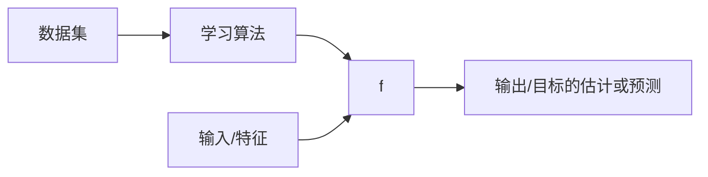

???+ info "信息"

    - 前置知识
    - 默认省略例子边框

线性回归模型属于监督学习, 同时是一个回归问题.

## 单变量线性回归模型

[单变量线性回归模型]("univariate linear regression"), 指的是只有一个输入/特征的回归模型. 

### 模型表示

**例子**: 预测住房价格.

**数据集**: 已知一个数据集, 包括某个城市的住房价格. 每个样本包括住房尺寸和售价.

**要求**: 根据不同住房尺寸所出售的价格, 画出数据集.

**问题**: 对于一个给定的住房尺寸, 预测它的售价.

这个数据集可以用坐标表示:

{:style="height:50%;width:50%"}

也可以用表格表示:

| 房屋大小 ($x$) | 价格 ($y$) |
| :---:         |     :---:      |
| 2104 | 460 |
| 1416 | 232 |
| 1534 | 315 |
| 852  | 178 |
| ...  | ... |
| 3210 | 870 |

### 术语

用如下符号来描述这个问题:

- $m$: 代表数据集中样本数量
- $x$: 代表输入/特征
- $y$: 代表输出/目标, 数据集中的实际真实值
- $\hat{y}$: $y$的估计或预测
- ($x, y$): 代表数据集中的一个样本
- ($x^{(i)}, y^{(i)}$): 代表第$i$个样本
- $f$: 代表学习算法的模型或函数也称为假设(hypothesis)

### 流程

