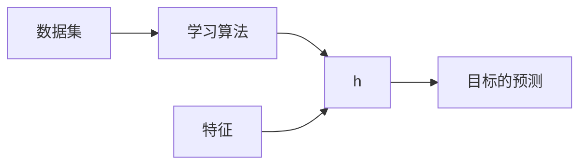

???+ info "信息"

    - 前置知识
    - 默认省略例子边框

线性回归模型属于监督学习, 同时是一个回归问题.

## 单变量线性回归模型

单变量线性回归模型(1), 指的是只有一个输入/特征的回归模型. 
{.annotate}

1. univariate linear regression

### 模型表示

#### 问题

**例子**: 预测住房价格.

**数据集**: 已知一个数据集, 包括某个城市的住房价格. 每个样本包括住房尺寸和售价.

**要求**: 根据不同住房尺寸所出售的价格, 画出数据集.

**问题**: 对于一个给定的住房尺寸, 预测它的售价.

这个数据集可以用坐标表示:

{:style="width:400px"}

也可以用表格表示:

| 房屋大小 ($x$) | 价格 ($y$) |
| :---:         |     :---:      |
| 2104 | 460 |
| 1416 | 232 |
| 1534 | 315 |
| 852  | 178 |
| ...  | ... |
| 3210 | 870 |

#### 术语

用如下符号来描述这个问题:

- $m$: 代表数据集中样本数量
- $x$: 代表输入/特征
- $y$: 代表输出/目标, 数据集中的实际真实值
- $\hat{y}$: $y$的估计或预测
- ($x, y$): 代表数据集中的一个样本
- ($x^{(i)}, y^{(i)}$): 代表第$i$个样本
- $h$: 代表学习算法的模型或函数也称为假设(hypothesis)

#### 流程

1. 把数据集(特征和目标)输入到学习算法
2. 学习算法计算出函数$h$. 函数的输入是特征$x$, 输出是目标的预测$\hat{y}$

#### 模型

对于房价预测问题, 模型/函数$h$可能的表述如下:

$h_{\theta}(x)=\theta_0+\theta_1 x$

将$\theta_0$和$\theta_1$称为模型/函数的参数. 在机器学习中, 模型的参数是可以在训练期间调整以改进模型的变量. 对于线性回归, 要做的就是选择参数的值以便更好的拟合数据, 选择的参数决定了$h$相对与数据集的准确程度.

定义建模误差(1)为模型所预测的值$\hat{y}$和实际值$y$之间的差距(蓝线表示):
{.annotate}

1. modeling error

{:style="width:400px"}

### 代价函数

为了衡量模型$h$的性能, 常见的方法是定义代价函数(1). 最常用的是均方误差函数(2):
{.annotate}

1. cost function
2. mean squared error

$J(\theta_1, \theta_1)=\frac{1}{2m}\sum^m_{i=1}(h_{\theta}(x^{(i)})-y^{(i)})^2=\frac{1}{2m}\sum^m_{i=1}(\hat{y}^{(i)}-y^{(i)})^2$

选取参数$\theta_1$和$\theta_2$以最小化代价函数$J$, 从而优化模型$h$.

???+ tip "Tip"

    除以$2$是为了让后面的计算看起来更加整洁, 无论是否除以$2$, 代价函数都有效.