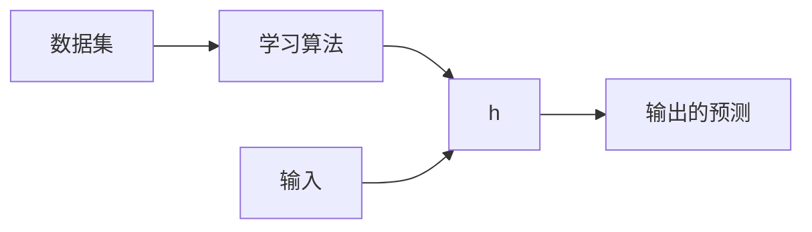

???+ info "信息"

    - 前置知识
		- [概率论](/数学/概率论)
    - 默认省略例子边框
	- Jupyter Notebook练习: 点击[这里](https://colab.research.google.com/drive/1fL_IWcuyA8Agm4K9kSOc_QtQXbMxT98S?usp=sharing)

线性回归模型属于监督学习, 同时是一个回归问题.

## 单变量线性回归模型

单变量线性回归模型(1), 指的是只有一个特征的回归模型. 
{.annotate}

1. univariate linear regression

### 模型表示

#### 问题

例子: 预测住房价格.

数据集: 已知一个数据集, 包括某个城市的住房价格. 每个样本包括住房尺寸和售价.

要求: 根据不同住房尺寸所出售的价格, 画出数据集.

问题: 对于一个给定的住房尺寸, 预测它的售价.

这个数据集可以用坐标表示:

{:style="width:400px"}

也可以用表格表示:

| 房屋大小 ($x$) | 价格 ($y$) |
| :---:         |     :---:      |
| 2104 | 460 |
| 1416 | 232 |
| 1534 | 315 |
| 852  | 178 |
| ...  | ... |
| 3210 | 870 |

#### 术语

用如下符号来描述这个问题:

- $m$: 代表数据集中样本数量
- $x$: 代表输入
- $y$: 代表输出, 数据集中的实际真实值
- $\hat{y}$: $y$的估计或预测
- ($x, y$): 代表数据集中的一个样本
- ($x^{(i)}, y^{(i)}$): 代表第$i$个样本
- $h$: 代表学习算法的模型或函数也称为假设(hypothesis)

#### 流程

1. 把数据集输入到学习算法
2. 学习算法计算出函数$h$. 函数的输入是输入$x$, 输出是输出的预测$\hat{y}$

#### 模型

对于房价预测问题, 模型/函数$h$可能的表述如下:

$h_{\theta}(x)=\theta_0+\theta_1 x$

将$\theta_0$和$\theta_1$称为模型/函数的参数. 在机器学习中, 模型的参数是可以在训练期间调整以改进模型的变量. 对于线性回归, 要做的就是选择参数的值以便更好的拟合数据, 选择的参数决定了$h$相对与数据集的准确程度.

定义建模误差(1)为模型所预测的值$\hat{y}$和实际值$y$之间的差距(蓝线表示):
{.annotate}

1. modeling error

{:style="width:400px"}

### 代价函数 {#代价函数}

- 基于均方误差函数最小化来进行模型求解的方法成为"最小二乘法"/"最小二乘估计".

#### 最小二乘估计

为了求解模型并衡量模型$h$的性能, 常见的方法是定义代价函数(1). 最常用的是均方误差函数(2):
{.annotate}

1. cost function
2. mean squared error

$J(\theta_0, \theta_1)=\frac{1}{2m}\sum^m_{i=1}(h_{\theta}(x^{(i)})-y^{(i)})^2=\frac{1}{2m}\sum^m_{i=1}(\hat{y}^{(i)}-y^{(i)})^2$

选取参数$\theta_1$和$\theta_2$以最小化代价函数$J$, 从而优化模型$h$.

???+ tip "Tip"

    除以$2$是为了让后面的计算看起来更加整洁, 无论是否除以$2$, 代价函数都有效.
    
可以绘制这个函数, 三个坐标分别为$\theta_0$, $\theta_1$, $J(\theta_0, \theta_1)$, 可以看到在三维空间中存在一个使得代价函数$J(\theta_0, \theta_1)$最小的点:

{:style="width:400px"}

将其呈现为等高线图:

{:style="width:550px"}

根据上图, 人工的方法很容易找到代价函数最小时对应的$\theta_0, \theta_1$, 但是我们真正需要的是一种有效的算法, 能够自动找出这些使代价函数达到最小值的参数, 参见下面的解法.

### 求解代价函数

#### 暴力求解 [^2]

#### 梯度下降 {#梯度下降}

梯度下降是一种求函数最小值的算法. 

梯度下降的思想是开始时随机选择一个参数组合$\theta_0, \theta_1$, 计算代价函数. 然后寻找下一个能让代价函数值下降最多的参数组合. 持续这么做会找到一个局部最小值, 因为我们没有尝试完所有的参数组合, 所以无法确定得到的局部最小值是否是全局最小值, 选择不同的初始参数组合, 可能会得到不同的局部最小值.

以输入为两个参数的代价函数为例, 不同的起始点导致不同的局部最小值:

{:style="width:400px"}

???+ tip "Tip"

	为了理解梯度下降, 可以想象站在山的一点上, 并且希望用最短的时间下山. 在梯度下降算法中, 要做的就是旋转360度, 看看周围, 要在某个方向上用小碎步尽快下山, 这些小碎步需要朝向什么方向? 如果我们站在山坡上的这一点, 看一下周围, 你会发现最佳的下山方向, 按照自己的判断迈出一步. 重复上述的步骤, 从新的位置, 环顾四周, 并决定从什么方向将会最快下山, 然后又迈进了一小步, 并依次类推, 直到你接近局部最低点的位置.
	
单变量线性回归的批量梯度下降(1)算法可以抽象为公式:
{.annotate}

1. batch gradient descent

$\mathrm{Repeat} \ \{\theta_j:=\theta_j-\alpha\frac{\partial}{\partial \theta_j}J(\theta_0, \theta_1)\}$, $j=0, 1$

???+ note "笔记"

	"批量"指的是在梯度下降的每一步中, 都用到了所有的训练样本. 详情见[这里](#在线性回归模型中的应用).

其中$\alpha$是学习率(1), 它决定了沿着能让代价函数下降程度最大的方向向下迈出的步子有多大; 在批量梯度下降中, 每一次同时让所有的参数减去学习速率乘以代价函数的偏导数. 

???+ warning "注意"

	更新的时候需要同时更新所有的参数, 而不是逐个更新. 这种更新的方式确保了在计算下一个参数的梯度的时候, 其他参数的值保持不变. 在同步更新中, 所有的偏导数都是基于同一组参数值$\theta_0, \theta_1$计算的.
	
	{:style="width:400px"}
  
##### 直观理解

考虑梯度下降的公示. 其中求导, 就是取下图红点的切线. 红色直线的斜率正好是三角形的高度除以水平长度, 这条线的斜率为正数, 也就是说它有正导数. 因此, $\theta_1$更新后等于$\theta_1$减去一个正数乘以$\alpha$.

{:style="width:550px"}

$\alpha$的取值的影响:

- 如果$\alpha$太小, 红点一点一点挪动, 需要很多步才能到达最低点
- 如果$\alpha$太大, 红点可能会直接越过最低点, 斜率的绝对值也有可能变大, 可能导致无法收敛
  
{:style="width:550px"}

如果我们预先把$\theta_1$放在局部的最低点, 下一步是什么?

假设将$\theta_1$初始化在局部最低点, 局部最低点的偏导数等于$0$. 因此$\theta_1$不再改变. 所以如果参数已经处于局部最低点, 那么对于那个参数来说, 梯度下降法什么都没做. 

在来看一遍这个过程:

{:style="width:550px"}

从品红点开始, 前进一步到绿点, 偏导数会减小, 在到新的红点, 偏导数继续减小, 所以每一步$\theta_1$更新的幅度都是在自动减小的. 直到最终的幅度趋近于$0$, 这个时候已经收敛到局部最小值.

???+ abstract "总结"

	- 在梯度下降法中, 当接近局部最低点的时候, 会自动采取更小的幅度. 这是因为偏导数会变得越来越小
	- 可以用梯度下降法最小化任何代价函数, 而不知是线性回归的代价函数
	
##### 在单变量线性回归中的应用 {#在线性回归模型中的应用}

在单变量线性回归模型中, 我们选择的[代价函数](#代价函数)是均方误差函数:

$J(\theta_0, \theta_1)=\frac{1}{2m}\sum^m_{i=1}(h_{\theta}(x^{(i)})-y^{(i)})^2$

- 对于$\theta_0$的偏导数为:

	$\frac{\partial}{\partial \theta_0}J(\theta_0, \theta_1)=\frac{\partial}{\partial \theta_0}\frac{1}{2m}\sum^m_{i=1}(h_{\theta}(x^{(i)})-y^{(i)})^2=\frac{\partial}{\partial \theta_0}\frac{1}{2m}\sum^m_{i=1}(\theta_0+\theta_1 x^{(i)}-y^{(i)})^2=\frac{1}{m}\sum^m_{i=1}(\theta_0+\theta_1 x^{(i)}-y^{(i)})=\frac{1}{m}\sum^m_{i=1}(h_{\theta}(x^{(i)})-y^{(i)})$
	
- 对于$\theta_1$的偏导数为:

	$\frac{\partial}{\partial \theta_1}J(\theta_0, \theta_1)=\frac{\partial}{\partial \theta_1}\frac{1}{2m}\sum^m_{i=1}(h_{\theta}(x^{(i)})-y^{(i)})^2=\frac{\partial}{\partial \theta_1}\frac{1}{2m}\sum^m_{i=1}(\theta_0+\theta_1 x^{(i)}-y^{(i)})^2=\frac{1}{m}\sum^m_{i=1}(\theta_0+\theta_1 x^{(i)}-y^{(i)})x^{(i)}=\frac{1}{m}\sum^m_{i=1}(h_{\theta}(x^{(i)})-y^{(i)})x^{(i)}$
	
根据批量梯度下降算法, 可以写出如下公式:

$\mathrm{Repeat}\ \{\theta_0:=\theta_0-\alpha \frac{1}{m}\sum_{i=1}^m(h_{\theta}(x^{(i)})-y^{(i)})\quad \theta_1:=\theta_1-\alpha \frac{1}{m}\sum^m_{i=1}(h_{\theta}(x^{(i)})-y^{(i)})x^{(i)}\}$

所谓"批量"由来是: 在梯度下降, 计算偏导数时, 需要求和运算, 对于每一个单独的梯度下降中, 最终都要计算这样一个东西, 我们用到了所有的训练样本.

## 多变量线性回归模型

### 模型表示

#### 问题

在之前的房价预测问题里面, 只考虑了一个特征, 即房屋大小, 这里我们考虑多个特征的问题, 比如在房价预测问题中, 引入房间数, 楼层, 年限等.

下面是一个示例数据:

| 房屋大小 | 房间数 | 楼层 | 年限 | 价格 ($y$) |
|:--------:|:------:|:----:|:----:|:----------:|
|   2104   |    5   |   1  |  45  |     460    |
|   1416   |    3   |   2  |  40  |     232    |
|   1534   |    3   |   2  |  30  |     315    |
|    852   |    2   |   1  |  36  |     178    |
|    ...   |   ...  |  ... |  ... |     ...    |

#### 术语

由于多维的特性, 需要引入更多的术语:

- $n$: 特征的数量
- $x^{(i)}$: 第$i$个样本/输入
- $x_j^{(i)}$: 第$i$个样本/输入中的第$j$个特征

#### 模型

对于房价预测问题, 模型/函数$h$可能的表述如下:

$h_{\theta}(x)=\theta_0+\theta_1 x_1+\theta_2 x_2+...+\theta_n x_n$

上述的公式中有$n+1$个参数和$n$个变量, 为了简化公式, 引入$x_0=1$, 上式写作:

$h_{\theta}(x)=\theta_0+\theta_1 x_1+\theta_2 x_2+...+\theta_n x_n=\theta^TX$, $T$表示矩阵转置.

### 代价函数

在多变量线性回归中, 也可以构建一个代价函数, 选取均方误差函数表示为:

$J(\theta_0, \theta_1, ..., \theta_n)=\frac{1}{2m}\sum^m_{i=1}(h_{\theta}(x^{(i)})-y^{(i)})$

### 梯度下降 

多变量梯度下降的目标和单变量线性回归中的一样, 要找出使代价函数最小的一些列参数. 多变量线性回归的批量梯度下降算法可以抽象为公式:

$\mathrm{Repeat}\ \{\theta_j:=\theta_j-\alpha\frac{\partial}{\partial \theta_j}J(\theta_0, \theta_1, ..., \theta_n)\}$, $j=0, 1, ..., n$

#### 在多变量线性回归中的应用

在多变量线性回归模型中, 我们选择的[代价函数](#代价函数)为均方误差函数:

$J(\theta_0, \theta_1, ..., \theta_n)=\frac{1}{2m}\sum^m_{i=1}(h_{\theta}(x^{(i)})-y^{(i)})$

对于$\theta_j$的偏导数为:

$\frac{1}{m}\sum^m_{i=1}(h_{\theta}(x^{(i)})-y^{(i)})x_j^{(i)}$

根据批量梯度下降算法, 可以写出如下公式:

$\mathrm{Repeat}\ \{\theta_j:=\theta_j-\alpha\frac{1}{m}\sum^m_{i=1}(h_{\theta}(x^{(i)})-y^{(i)})x_j^{(i)}, j=0, 1, ..., n\}$

#### 特征缩放

在面对多变量线性回归模型时, 要保证特征具有相近的尺度, 使梯度下降算法更快收敛.

以房价问题为例, 假如有两个特征, 房屋尺寸和房间数量. 尺寸值为$0-2000$平方英尺, 房间数量为$0-5$. 以这两个参数为横纵坐标, 绘制代价函数的等高线图, 可以看出图像会很扁. 梯度下降算法需要非常多次的迭代才能收敛.

{:style="width:200px"}

???+ bug "Bug"

	上图中$J(\theta)$函数是一个关于$\theta_0$的函数, 在上图中没有很好的体现出来.

解决方法是尝试将所有特征的尺度都尽量缩放到$-1$和$1$之间.

{:style="width:550px"}

##### 数据标准化

对于特征缩放, 一个更正规的方法是做数据标准化, 将所有的数据都限制到一个合理的区间内.

标准化公式为:

$x_n=\frac{x_n-\mu_n}{s_n}$

其中$\mu_n$是平均值, $s_n$是标准差.

#### 学习率

梯度下降算法收敛所需要的迭代次数根据模型的不同而不同, 虽然不能提前预知, 但是可以画出迭代次数和代价函数的图标连观测算法在何时趋于收敛. 如下图所示, 可以看到代价函数随着迭代次数增加而不断减小. 当迭代次数来到300次后, 代价函数降低的趋势已经非常小了, 说明已经收敛.

{:style="width:400px"}

也有一些自动测试是否收敛的方法, 例如将代价函数的变化值和某个阈值(例如0.0001)进行比较, 如果比阈值小, 就认为已经收敛. 

原则是: 有效的学习率可以让代价函数随着迭代不断减小. 但是太小的学习率会导致收敛得很慢.

[^1]: Machine-learning-deep-learning-notes/machine-learning/linear-regression.md at master · loveunk/machine-learning-deep-learning-notes. (n.d.). Retrieved June 26, 2024, from https://github.com/loveunk/machine-learning-deep-learning-notes/blob/master/machine-learning/linear-regression.md
[^2]: 第3章 线性模型. (n.d.). Retrieved June 27, 2024, from https://datawhalechina.github.io/pumpkin-book/#/chapter3/chapter3
[^3]: 周志华. (n.d.). 机器学习.