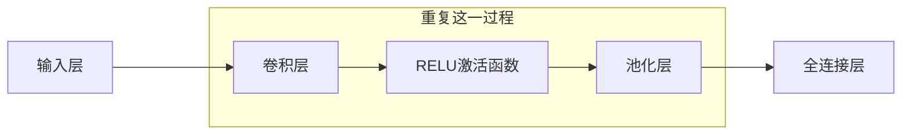

卷积神经网络, Convolutional Neural Networks, CNN, 是一种特殊类型的多层神经网络, 利用反向传播算法进行训练. 设计目标是直接从图像的像素中识别视觉部分, 而不需要做预处理, 如OCR. CNN对图像的扭曲和几何变化如平移有很强的鲁棒性, 在图像和声音设别中表现出色, 尤其是在手写数字识别, 面部检测和图像分类等任务上可以取得优异成绩.

## 历史

1989年, Yan LeCun等人首次提出了卷积神经网络的概念, 这是CNN的最早发展阶段, 主要用于手写字符识别, OCR. 2012年, AlexNet(由Alex Krizhe等人提出的深度卷积神经网络)在ImageNet竞赛中获取了胜利, 标志着深度学习和CNN的重大突破. AlexNet的成功显著降低了错误率, 从$26\%$降至$15\%$, 使CNN称为计算机视觉领域的主流方法.

## 优势

CNN主要用于图像的识别(也可以用于其他形式的数据). 图像由矩阵描述, 对于8位灰白图, 每个像素的取值范围是$0$到$255$, 每张图对应于一个矩阵; 对于8位彩色图, 有三种通道, 红色, 绿色和蓝色, 每个通道的的取值范围是$0$到$255$, 每个通道对应于一个矩阵, 所以每张图对应于三个矩阵.

<figure markdown='1'>
{ loading=lazy width='500' }
</figure>

传统的神经网络, 如多层前馈神经网络无法考虑图像的空间结构, 如下图显示传统神经网络会将图像的像素展平为一列, 直接作为网络的输入. 这种方式忽略了像素之间的空间关系, 导致网络难以捕捉到图像中的重要特征, 例如形状, 边缘等.

<figure markdown='1'>
{ loading=lazy width='500' }
</figure>

CNN通过卷积层和池化层等新类型的层来客服这个问题. 卷积层能够处理图像的空间信息, 保持像素之间的相对位置; 池化层则帮助减少计算量, 同时保留关键信息, 进一步提高模型的泛化能力.

传统的神经网络还对图像中的物体的位置特别敏感, 如下图. 

<figure markdown='1'>
{ loading=lazy width='500' }
</figure>

图中的字母P只是向左平移了$2$个像素, 但是输入却发生了很大的改变, 这会导致已经训练得到的模型在平移之后的图像上表现很差, CNN对这种平移或转换有很强的鲁棒性.

## 架构 

- 输入层: 接受像素值作为输入
- 卷积层: CONV, 用于从输入中提取局部特征, 通过卷积核对图像进行滑动计算, 保留纹理等特征
- RELU激活函数: 引入非线性因素, 帮助模型学习更加复杂的特征
- 池化层: POOL, 用于降低特征图的维度, 同时保留关键信息, 提高泛化能力
- 全连接层: FC, 也被称为密集层, 每个神经元都与前一层的所有神经元相连

如下图所示, 3个重复的CONV-RELU-POOL和2个全连接层.

<figure markdown='1'>
{ loading=lazy width='500' }
</figure>