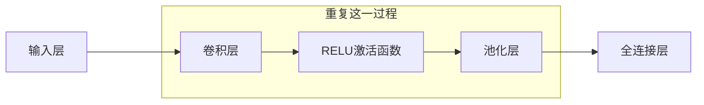

卷积神经网络, Convolutional Neural Networks, CNN, 是一种特殊类型的多层神经网络, 利用反向传播算法进行训练. 设计目标是直接从图像的像素中识别视觉部分, 而不需要做预处理, 如OCR. CNN对图像的扭曲和几何变化如平移有很强的鲁棒性, 在图像和声音设别中表现出色, 尤其是在手写数字识别, 面部检测和图像分类等任务上可以取得优异成绩.

## 历史

1989年, Yan LeCun等人首次提出了卷积神经网络的概念, 这是CNN的最早发展阶段, 主要用于手写字符识别, OCR. 2012年, AlexNet(由Alex Krizhe等人提出的深度卷积神经网络)在ImageNet竞赛中获取了胜利, 标志着深度学习和CNN的重大突破. AlexNet的成功显著降低了错误率, 从$26\%$降至$15\%$, 使CNN称为计算机视觉领域的主流方法.

## 优势

CNN主要用于图像的识别(也可以用于其他形式的数据). 图像由矩阵描述, 对于8位灰白图, 每个像素的取值范围是$0$到$255$, 每张图对应于一个矩阵; 对于8位彩色图, 有三种通道, 红色, 绿色和蓝色, 每个通道的的取值范围是$0$到$255$, 每个通道对应于一个矩阵, 所以每张图对应于三个矩阵.

<figure markdown='1'>
{ loading=lazy width='500' }
</figure>

传统的神经网络, 如多层前馈神经网络无法考虑图像的空间结构, 如下图显示传统神经网络会将图像的像素展平为一列, 直接作为网络的输入. 这种方式忽略了像素之间的空间关系, 导致网络难以捕捉到图像中的重要特征, 例如形状, 边缘等.

<figure markdown='1'>
{ loading=lazy width='500' }
</figure>

CNN通过卷积层和池化层等新类型的层来客服这个问题. 卷积层能够处理图像的空间信息, 保持像素之间的相对位置; 池化层则帮助减少计算量, 同时保留关键信息, 进一步提高模型的泛化能力.

传统的神经网络还对图像中的物体的位置特别敏感, 如下图. 

<figure markdown='1'>
{ loading=lazy width='500' }
</figure>

图中的字母P只是向左平移了$2$个像素, 但是输入却发生了很大的改变, 这会导致已经训练得到的模型在平移之后的图像上表现很差, CNN对这种平移或转换有很强的鲁棒性.

## 架构 

- 输入层: 接受像素值作为输入
- 卷积层: CONV, 用于从输入中提取局部特征, 通过卷积核对图像进行滑动计算, 保留纹理等特征
- RELU激活函数: 引入非线性因素, 帮助模型学习更加复杂的特征
- 池化层: POOL, 用于降低特征图的维度, 同时保留关键信息, 提高泛化能力
- 全连接层: FC, 也被称为密集层, 每个神经元都与前一层的所有神经元相连

如下图所示, $3$个重复的CONV-RELU-POOL和$2$个全连接层.

<figure markdown='1'>
{ loading=lazy width='500' }
</figure>

CNN和全连接神经网络非常相似, 都由具有可学习权重的神经元组成. 每个神经元会接受一些输入, 然后执行点积运算, 之后再通过一个非线性的激活函数. 从原始的图像像素到分类得分, 整个网络可以被表示为一个可微分的函数, 使用反向传播算法, 逐步调整网络中的权重和截距以最小化误差. 

## 卷积层

卷积类似于在矩阵上应用一个滑动窗口, 对应的元素(滤波器/卷积核的权重和图像的像素值)进行相乘并求和. 以一个黑白图片作为例子, 其中像素值为$1$或者$0$. 这里使用了一个$3\times 3$的滤波器, 它从左到右, 从上到下在图像上滑动, 在每一步都执行卷积操作. 卷积的结果称为"特征图"或者"激活图". 在上图中, 特征图的第一个值为$4$, 计算过程为$1\times 1 + 1\times 0 + 1\times 1 + 0\times 0 + 1\times 1 + 1\times 0 + 0\times 1 + 0\times 0 + 1\times 1 = 4$.

<figure markdown='1'>
{ loading=lazy width='300' }
</figure>

我们可以将滤波器看作是一个特征发现器. 如下图是一个发现一条曲线的滤波器.

<figure markdown='1'>
{ loading=lazy width='400' }
</figure>

现在, 我们将这个滤波器用于一张我们想要分类图片(一张老鼠🐭的简笔画)的左上角上, 

<figure markdown='1'>
{ loading=lazy width='500' }
</figure>

在这个区域进行卷积计算得到的值为$(50\times 30)+(50\times 30)+(50\times 30)+(20\times 30)+(50\times 30)=6600$, 这个值非常大! 说明这边很可能有一根类似的曲线.

我们尝试将滤波器移到图片的另一个地方, 老鼠的耳朵上.

<figure markdown='1'>
{ loading=lazy width='550' }
</figure>

在这个区域进行卷积计算计算得到的值为$0$. 这说明在图上没有任何和曲线滤波器相同的地方.

### 感受野[^1]

感受野, receptive field. 特征图上某个元素的计算受输入图像上的某个区域影响, 这个区域就是该元素的感受野. 在卷积神经网络中, 越深层的神经元看到的输入区域越大, 如下图所示, 卷积核的大小均为$3\times 3$, 步幅(stide)均为$1$. 第二层的每个神经元可以看到第一层的$3\times 3$大小的区域, 第三层的每个神经元可以看到第二层上$3\times 3$大小的区域, 又可以看到第一层上$5\times 5$大小的区域.

<figure markdown='1'>
{ loading=lazy width='250' }
</figure>

所以, 感受野是一个相对的概念, 某层的特征图上的元素看到前面不同层的区域范围是不同的, 通常在不特殊指定的情况下, 感受野指的是看到输入图像上的区域.

[^1]: 彻底搞懂感受野的含义与计算 - shine-lee - 博客园. (不详). 取读于 2024年9月18日, 从 https://www.cnblogs.com/shine-lee/p/12069176.html
